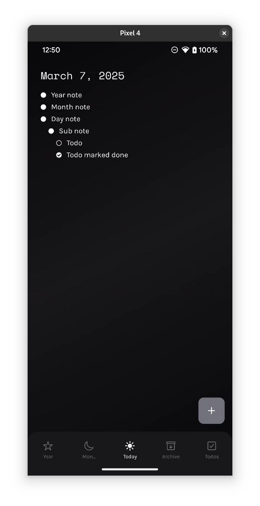
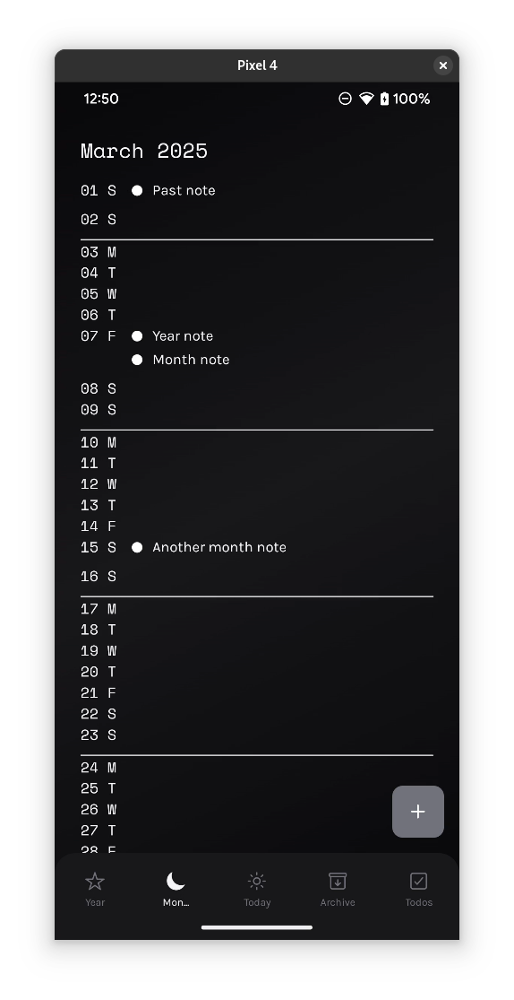
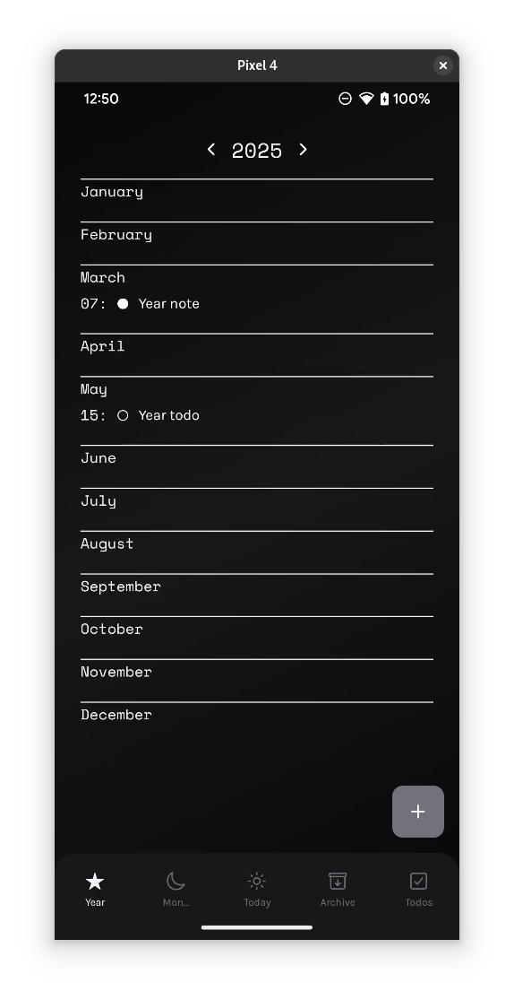
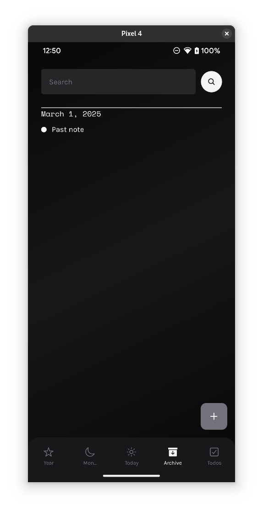
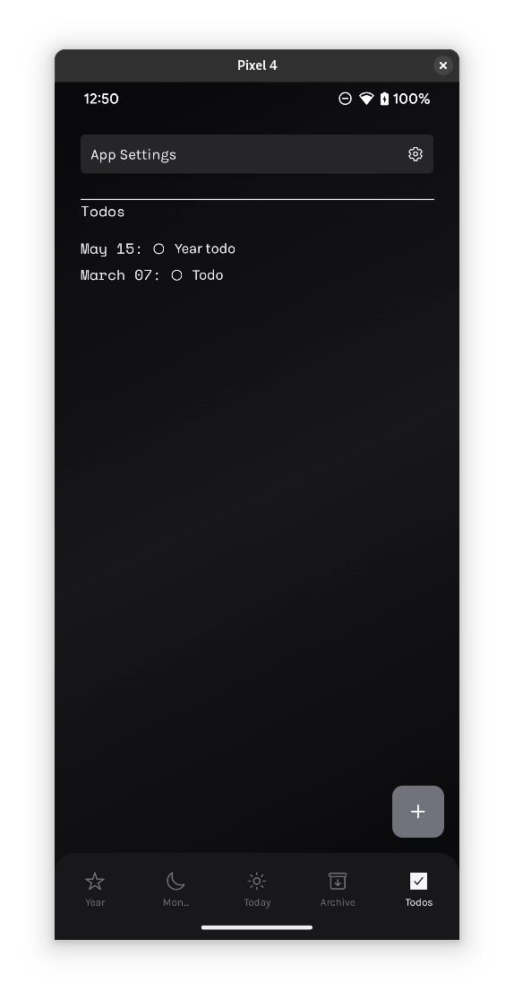

# catata

> [!NOTE]
> Currently in `alpha`.

Local android note-planner app based on [Ryder Carroll bullet
journaling](https://www.youtube.com/watch?v=GfRf43JTqY4) method.

### Screenshots:
Might be outdated.

<p float="left">
    
    
    
    
    
</p>

## Usage
1. Any notes or tasks that come up today, can be added through the 'Add'
   button.
   - You can change the date, toggle the type: `note/task`, scope:
     `day/month/year`, as well as add a subnote to the currently editing
     note.
   - Deletion will cascade to all the children.

> [!CAUTION]
> Deletion is permanent and does not ask for confirmation.

2. Any plans in the upcoming month or year can be added by pressing the
   corresponding date in both the 'Month' and 'Year' page.
   - Any notes/tasks added here automatically appears in the daily page
     on the day of.
3. You can see notes on previous days in the 'Archive' page.
    - You can also search for any note by text or date.
4. All unfinished taskes appear in the 'Todos' page

## TODO
For `beta` release.

- [x] Working search bar.
- [ ] Working light mode.
    - [ ] Streamline colors module.
- [ ] Changeable start of week and year (e.g. start of semester).

## Known Issues

- `NoteModal` rerenders text input on change.

## Building

```
bunx expo prebuild -p android
cd android
./gradlew assemble
```

## Working Dir

```
src/
├── app
│   ├── _layout.tsx
│   ├── settings.tsx
│   ├── (tabs)
│   │   └ ...
│   └── [year-month].tsx  // month page for arb year
├── components
│   ├── icons.tsx
│   ├── index.tsx
│   ├── note-list.tsx     // the atomic block
│   └── note-modal.tsx    // the editing modal
├── db
│   ├── index.ts          // database functions
│   └── schema.ts
├── drizzle               // drizzle migrations
│   └ ...
├── colors.ts             // colorschemes
├── styles.ts             // globalstyles
└── utils.ts              // convenience functions
app.json                  // app config
eas.json                  // eas config
Makefile                  // eas commands
genconfig.ts              // generates app config
```
